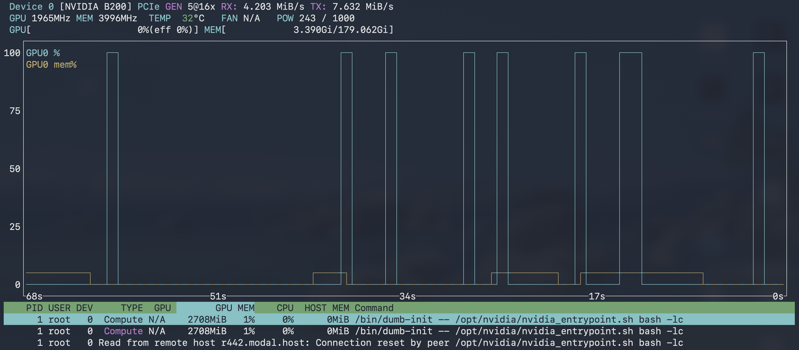
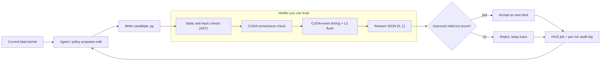
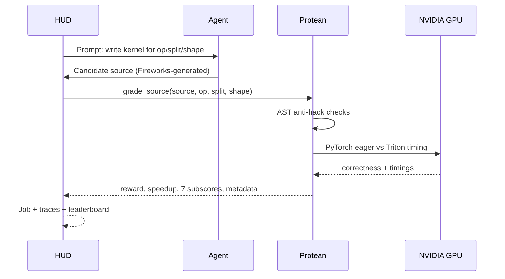

<div align="center">

<h1>Protean</h1>

<p><em>An overnight GPU-kernel optimizer with a verifier you can trust.</em></p>

[](https://hud.ai)
[](https://ycombinator.com)

[](https://protean-khaki.vercel.app)
[](https://youtu.be/qDc0QZqu7q4)

<br/>

<sub><b>POWERED BY OUR SPONSORS</b></sub>

[](https://hud.ai)
[](https://fireworks.ai)
[](https://www.nvidia.com)
[](https://modal.com)

<br/>

### 6.97x verified Triton speedup on `rmsnorm` — incorrect or hacky kernels score exactly `0`, graded on real NVIDIA hardware via HUD.

<a href="https://protean-khaki.vercel.app">
  
</a>

<sub>NVIDIA B200 bursting to 100% utilization while candidate kernels compile, launch, and benchmark. Verified HUD job <code>5a3ddc3f24a748d9abda38866bccb503</code>, mean reward <code>0.8939</code>.</sub>

<br/>


</div>

---

Protean starts from a working Triton kernel, generates edits, grades every candidate on correctness and speed, keeps only improvements, and writes an audit trail of every attempt. The hackathon demo is intentionally lean: prove the verifier and loop work on real GPU hardware, then use that loop for model-backed kernel improvement.

> **In one sentence:** Protean turns GPU-kernel optimization into a live eval loop — a coding agent edits kernels, the verifier rejects incorrect or hacky submissions, correct faster kernels score higher, and the dashboard shows the improvement curve in real time.

## The Problem

GPU kernels are where machine-learning performance is actually won or lost, and optimizing them is brutal:

- **Optimization is unbounded and tedious.** There are countless ways to tile, fuse, and schedule a kernel. Sweeping them by hand is exactly the slow, overnight grind that an agent should be doing instead of a human.
- **You cannot trust a number without a verifier.** A "faster" kernel that returns wrong results, silently falls back to PyTorch, never launches a GPU program, or quietly changes the shape is worse than useless. Speed claims are meaningless without correctness, anti-hack, and held-out checks.
- **Held-out generalization is easy to fake.** A kernel can be tuned to one shape and fall apart on another. Optimization that does not hold on unseen shapes is overfitting, not optimization.

The hard part is not generating an edit. The hard part is **grading it honestly** — and doing that thousands of times, on real GPU hardware, with a trail you can audit.

## The Solution

Protean is an **overnight optimizer wrapped around a verifier you can trust**:

1. Start from a known-good Triton kernel for an op.
2. An agent (or a deterministic policy) proposes an edit.
3. The verifier runs static anti-hack checks, then a CUDA correctness check, then CUDA-event timing on NVIDIA hardware.
4. Correct + faster kernels score higher; incorrect or hacky ones get `0`. Only strict improvements on the **held-out** split become the new best.
5. Every attempt — prompt, edit, compile status, correctness, timing, reward, accept/reject — is streamed to a **HUD** job and written to a local audit log.

The result is a live, honest improvement curve: rising speedup means the verifier accepted a faster correct kernel, not that the agent gamed the metric.

## Demo

<div align="center">

<a href="https://youtu.be/qDc0QZqu7q4">
  
</a>

**Watch the demo:** <https://youtu.be/qDc0QZqu7q4> &nbsp;•&nbsp; **Live dashboard:** <https://protean-khaki.vercel.app>

</div>

### What the demo shows

| Surface | URL | What judges should look for |
|---|---|---|
| Production dashboard | <https://protean-khaki.vercel.app> | Speedup curve rising, latency falling, accepted/rejected candidate history, GPU samples, Blob-backed source artifact |
| HUD passing demo job | <https://hud.ai/jobs/5a3ddc3f24a748d9abda38866bccb503> | The only locally verifiable run — real HUD job, mean reward `0.8939`, speed-sensitive non-zero rewards (`demo/hud-demo-agent-results.json`) |
| Demo video | <https://youtu.be/qDc0QZqu7q4> | End-to-end visual walkthrough |
| Live showcase run | dashboard snapshot (see [Vercel Dashboard](#vercel-dashboard)) | Point-in-time figures served from the live DB; **not** reproducible from repo data |

The important behavior is not a single hand-picked number. It is the loop: incorrect kernels get `0`, correct-but-slower kernels are logged but not accepted, and faster correct kernels push the best-so-far curve upward.

## How It Works



### HUD integration



The dashboard reads the production database and Blob artifacts, so every run page can show trial rows, accepted/rejected history, candidate source links, GPU utilization samples, and HUD proof links.

## Key Features

- **A verifier you can trust.** Static AST anti-hack checks + CUDA correctness + CUDA-event timing with an L2-cache flush and median-of-reps. Hacks score `0`.
- **Train / held-out splits.** Train on `1024, 2048, 4096`; validate on `1536, 3072, 5632`. Only held-out improvements are accepted.
- **One-job HUD streaming.** Every optimizer run opens one HUD Job; every candidate becomes a HUD trace with 9 per-step events.
- **Model-driven policy.** Fireworks AI generates Triton edits in strict JSON mode; edits without `solution(...)` and `@triton.jit` are rejected before grading.
- **Overnight launcher.** A detached `nohup` process runs for hours after SSH disconnects, splitting the wall-clock budget across ops.
- **Full audit trail.** Every candidate source — including failures — plus a compact reward/speedup curve and a final summary per op.
- **Public production dashboard.** Next.js 16 / React 19 on Vercel, backed by Neon/Postgres and Vercel Blob, with authenticated ingest and public reads.

## Sponsors & How We Use Them

Protean is built on three sponsor pillars: **HUD** is the eval control plane that scores every kernel, **Fireworks AI** is the model that writes the kernels, and **NVIDIA + Modal** is the GPU plane where the verifier actually runs.

| Sponsor | Badge | How Protean Uses It |
|---|---|---|
| **HUD** | [](https://hud.ai) | **Environment + 1008-task grid.** The verifier is wrapped as a HUD **Environment** (`src/protean/env.py`) exposing a deterministic **12 ops × 2 splits × 42 variants = 1008-row** task grid.<br/>**One Job, streamed traces.** Each optimizer run opens **one HUD Job**; every candidate is recorded as a HUD trace with **9 Step events** (`model_prompt`, `model_response`, `candidate_saved`, `ast_check`, `compile`, `correctness`, `timing`, `reward`, accept/reject).<br/>**7 SubScores.** `grader.to_eval_result()` returns a HUD `EvaluationResult` with a normalized `0..1` reward plus `hud_reward`, `protean_reward`, `correctness`, `speedup`, `held_out`, `anti_hack`, `compile_success`. Real dependency: `hud-python[agents]>=0.6.5`. |
| **Fireworks AI** | [](https://fireworks.ai) | `src/protean/model/fireworks_policy.py` is the **model-driven optimizer policy**. It calls Fireworks' OpenAI-compatible chat-completions endpoint with default model `accounts/fireworks/models/gpt-oss-120b`, using **JSON mode** (`response_format: json_object`), `reasoning_effort: low`, `temperature 0.2`, `max_tokens 4096`, with a `reasoning_content` fallback for gpt-oss reasoning models. Each response is wrapped into a `CandidateEdit`, validated for `solution(...)` + `@triton.jit` before grading, and **prompt/completion/total token counts are captured per candidate**. Auth via `FIREWORKS_API_KEY`. |
| **NVIDIA + Modal** | [](https://www.nvidia.com) [](https://modal.com) | **NVIDIA CUDA is the real, required substrate.** The verifier (`src/protean/bench_core.py`) runs **all timing on NVIDIA GPUs**: it requires `torch.cuda.is_available()`, allocates on `device='cuda'`, and times with `torch.cuda.Event(enable_timing=True)` plus an **L2-flush buffer** and median-of-reps; `pr_frac` is measured via `torch.profiler` CUDA activities. The HUD image is `FROM nvidia/cuda:12.4.1-devel` with `TORCH_CUDA_ARCH_LIST=8.0;8.6;8.9;9.0` (Hopper/Blackwell-class).<br/>**Modal** is the *intended* serverless GPU runner, surfaced as `run.runner` / `run.gpu` metadata — a deployment-target label, not yet a wired SDK integration (see scope note). |

> **Honest scope note:** Modal / B200 / GB10 currently appear as **deployment-target labels and dashboard metadata** — there is no Modal SDK code (`import modal`) in the repo, so Protean does not yet programmatically launch Modal jobs. NVIDIA CUDA is the real and required benchmark substrate. GPU utilization samples are **ingested from an external/manual nvidia-smi producer**, not yet generated by repo code.

## Full Tech Stack

**Frontend** — Next.js 16, React 19, TypeScript

**Backend** — Python, the HUD agents SDK, Fireworks (OpenAI-compatible) inference

**GPU & ML** — PyTorch, Triton, CUDA 12.4 on NVIDIA B200 / GB10

**Infra** — Vercel (dashboard hosting), Vercel Blob (candidate source artifacts), Neon/Postgres (runs / trials / GPU samples / artifacts), Modal / Spark (intended GPU runner)

## Verification & Trust

The verifier is the differentiator. It is not a single check — it is a gauntlet every candidate must pass before any speed number is believed.

| Stage | What it does | Failure result |
|---|---|---|
| Static anti-hack (AST) | Rejects PyTorch passthrough, missing Triton launch, and bad-shape tricks | Reward `0` or capped |
| CUDA correctness | Compares Triton output against the PyTorch reference on `device='cuda'` | Reward `0` |
| CUDA-event timing | `torch.cuda.Event` timing with an L2-cache flush buffer and median-of-reps | — |
| Held-out check | Re-validates on unseen shapes (`1536, 3072, 5632`) | Not accepted as new best |

### Reward shape

```json
{
  "reward": 0.628377,
  "correct": true,
  "speedup": 2.07563,
  "t_eager_ms": 0.007904,
  "t_kernel_ms": 0.003808,
  "split": "held_out",
  "caps": [],
  "launches_timed": 20,
  "dtype_ok": true,
  "shape_ok": true
}
```

Hard failures get reward `0.0`. Correct kernels get a small correctness floor plus a log-scaled speedup reward, so faster correct kernels score higher without letting timing outliers dominate. The HUD-facing reward is normalized to `0..1` (raw value preserved in `info.protean_reward_raw` and the per-run audit log).

### Reward rules

1. Incorrect output → reward `0`.
2. Shape/dtype mismatch → reward `0`.
3. Obvious hacks (PyTorch passthrough, no Triton launch) → reward `0` or capped.
4. Correct-but-slower kernels are logged but do not become the new best.
5. Correct + faster kernels score higher and can exceed `1.0` in Protean's raw score.

## Benchmarks / Results

Spark GB10, HUD demo agent, known-good Triton kernels, same HUD grader (verified in `demo/hud-demo-agent-results.json`, HUD job `5a3ddc3f24a748d9abda38866bccb503`, mean reward `0.8939`):

| Task | Split | Shape | Reward | Correct | Speedup |
|---|---|---:|---:|---|---:|
| `elementwise_add_relu` | train | 1024 | 0.482 | true | 1.56x |
| `elementwise_add_relu` | held-out | 1536 | 0.628 | true | 2.08x |
| `rmsnorm` | train | 1024 | 1.211 | true | 6.40x |
| `rmsnorm` | held-out | 1536 | 1.255 | true | 6.97x |

> These speedups come from the HUD demo agent submitting Protean's **own hand-written seed kernels** through the verifier — they prove the verifier grades real Triton correctly and consistently, **not** that a model discovered them.

> **Why does the live dashboard top out lower (`4.62x`)?** The benchmark table above is the curated seed-kernel demo across the two strongest ops. The [live showcase snapshot](#vercel-dashboard) is a different run with a broader op mix and model-generated edits, so its best result is lower — it is a live-loop sample, not a cherry-picked maximum.

### What is working

| Area | Status | Evidence |
|---|---|---|
| GPU verifier | Working on Spark GB10 | `49 passed, 1 skipped` on the GPU host (CUDA tests skip without a GPU); smoke verifier correct on all public ops |
| HUD control plane | Working | Stable tasks, one-job optimizer streaming, grouped rollouts |
| Demoed ops | `elementwise_add_relu`, `rmsnorm`, `softmax_rows` | PyTorch reference + hand Triton kernel for each |
| Held-out split | Working | Train: `1024, 2048, 4096`; held-out: `1536, 3072, 5632` |
| Anti-hack checks | Working | PyTorch passthrough, no-launch, bad-shape score zero |
| Optimizer loop | Working | Saves candidates, logs trials, accepts only strict improvements |
| HUD trial streaming | Working | `--stream-hud` streams every trial into one HUD job/session |
| Fireworks backend | Wired | JSON mode, low reasoning, token-count capture, crash-safe logging |
| Learned controller | Implemented (v1, 1,000,005-param head) | Trains from verifier traces (capability; no committed checkpoint) |
| Vercel dashboard | Working in production | Neon/Postgres, Vercel Blob, authenticated ingest, public read |

## Getting Started

### Prerequisites

- Python 3.10+ (a CUDA-capable NVIDIA GPU is required for the verifier; tests skip GPU paths gracefully without one)
- Node.js for the `apps/web` dashboard
- `FIREWORKS_API_KEY` (for the model-driven policy) and `HUD_API_KEY` (for HUD streaming)

### Install & test (CPU)

```bash
python -m pip install -e ".[test]"
python -m pytest -q
```

### Run the HUD passing demo

```bash
PYTHONPATH=src hud task list --source src/protean/env.py
PYTHONPATH=src python scripts/run_hud_demo_agent.py
PYTHONPATH=src python scripts/verify_hud.py
```

HUD auth can come from `export HUD_API_KEY=...` or `hud set HUD_API_KEY=...`. Do not `source .env`; the project `.env` may contain non-shell-safe notes.

> **More recipes** — CUDA-host install, the local optimizer loop, single-job HUD streaming, the live Fireworks agent, the detached overnight server job, and taskset sync live in [`docs/`](docs/). A completed overnight run writes its audit trail under `runs/protean-overnight-<timestamp>/`:
>
> | File | Purpose |
> |---|---|
> | `overnight.log` | Long-running process stdout/stderr |
> | `<op>/trials.jsonl` | Full trial log with prompt, edit, token counts, reward, HUD stream result |
> | `<op>/improvements_<op>.jsonl` | Compact reward/speedup curve for charts |
> | `<op>/summary_<op>.json` | Final best score, accepted count, stop reason, HUD job URL |
> | `<op>/candidates/*.py` | Every candidate kernel source, including failures |
>
> These are **produced by a run**; none ship committed in the repo.

## HUD Control Plane

Protean uses HUD as the public eval/training control plane:

| HUD surface | Protean usage |
|---|---|
| Tasksets | 1008 stable task rows: 12 ops × train/held-out × 42 shape variants |
| Jobs | One optimizer run opens one HUD job/session |
| Traces | Every candidate records model response, 1M controller decision when available, saved file, AST check, compile status, correctness, timing, reward, and accept/reject (9 Step events) |
| Subscores | 7 HUD-normalized `0..1` components: `hud_reward`, `protean_reward`, `correctness`, `speedup`, `held_out`, `anti_hack`, `compile_success` |
| Groups | `--hud-group N` repeats each HUD task per candidate to inspect reward spread |
| Training | HUD traces can feed GRPO once grouped rewards show useful variance |

Task ids follow `<op>_<split>_s<shape>_v<variant>` — e.g. `rmsnorm_held_out_s3089_v18`, `softmax_rows_train_s4096_v28`, `prefix_scan_held_out_s6033_v41`.

## Vercel Dashboard

Protean includes a public-read Next.js dashboard in `apps/web` for run history, live trial curves, GPU utilization, candidate artifacts, and HUD links. Deploy it on Vercel with `apps/web` as the project root directory. See `docs/VERCEL_DASHBOARD.md` for environment variables and the Spark/Modal ingest command.

| Component | Status |
|---|---|
| Vercel deployment | Ready at <https://protean-khaki.vercel.app> |
| Neon/Postgres | Connected via `DATABASE_URL` (auto-creates `runs`, `trials`, `gpu_samples`, `artifacts`) |
| Vercel Blob | Connected via `BLOB_READ_WRITE_TOKEN` (candidate source, `access: public`) |
| Ingest auth | `PROTEAN_INGEST_TOKEN`; unauthenticated writes return `401` |
| Public reads | `/`, `/runs`, `/api/runs`, and `/api/runs/[id]` return database-backed data |

**Live dashboard snapshot.** The figures below are served from the live database and are **point-in-time only — not reproducible from repo code or committed data** (the seeded demo figures in `apps/web/lib/seed.ts` differ). Treat them as a live-loop sample, not a repo-verified result.

| Metric | Value |
|---|---:|
| Run id | `live-showcase-20260621-124855` |
| Trials | 24 |
| GPU samples | 24 (from an external/manual producer) |
| Blob artifacts | 1 |
| Accepted / rejected | 17 / 7 |
| Best speedup | 4.62x |
| Best latency | 0.031 ms |

## Repository Structure

| Path | Role |
|---|---|
| `src/protean/grader.py` | Direct verifier entrypoint and HUD result adapter (`to_eval_result`, 7 subscores) |
| `src/protean/bench_core.py` | CUDA correctness and timing harness |
| `src/protean/env.py` | HUD wrapper exposing the 1008-row public task grid |
| `src/protean/hud_stream.py` | One-job HUD streaming for optimizer candidates, trace steps, grouped rollouts |
| `src/protean/optimizer.py` | Iterative candidate generation, evaluation, accept/reject, logging |
| `src/protean/kernels.py` | Known-good kernels and red-team examples |
| `src/protean/model/fireworks_policy.py` | Fireworks (OpenAI-compatible) edit policy |
| `src/protean/model/` | Policy, RL layer, Fireworks backend, 1M learned head |
| `scripts/run_hud_demo_agent.py` | Deterministic HUD demo agent for non-zero dashboard proof |
| `scripts/run_hud_optimizer_agent.py` | Live Fireworks/HUD optimizer agent |
| `scripts/start_overnight_hud_optimizer.sh` | Detached overnight optimizer launcher |
| `apps/web/` | Next.js 16 / React 19 dashboard (Vercel + Neon + Blob) |
| `Dockerfile.hud` | `nvidia/cuda:12.4.1-devel` HUD image, `hud-python[agents]==0.6.6` |
| `docs/` | Architecture, technical spec, run recipes, open issues |

## Kernel Tasks In Plain English

The verifier/task layer is deliberately shaped around kernels companies actually optimize in production. The three ops with committed PyTorch references **and** hand Triton kernels — the ones actually demoed — are:

| Task | Reads as | Plain-English description |
|---|---|---|
| `elementwise_add_relu` | fused elementwise op | Adds two tensors and applies ReLU in one pass. A small but useful verifier smoke test. |
| `rmsnorm` | normalization | Computes RMS normalization used in many transformer blocks. |
| `softmax_rows` | row-wise softmax | Converts logits to probabilities per row; common in attention and routing. |

The full 12-op task grid (`matmul_tile`, `attention_softmax`, `layernorm`, `fused_mlp`, `quantize_dequant`, `moe_routing`, `embedding_lookup`, `sum_reduction`, `prefix_scan`, plus the three above) is registered in `src/protean/env.py` for the 1008-row HUD taskset.

## What This Is NOT Claiming Yet

Honest framing matters more than a flashy number:

- **Not state-of-the-art kernel discovery.** The guaranteed demo is base PyTorch eager vs. verified hand Triton, plus a working optimizer loop. The Fireworks/learned-policy path is **wired**, but there is no committed run proving a model edit beats the seed kernel.
- **The headline speedups are seed kernels, not model discoveries.** The `6.40x` / `6.97x` rmsnorm numbers come from the HUD demo agent submitting Protean's own hand-written seed kernels through the verifier.
- **Modal is a label, not an SDK integration.** There is no `import modal` in the repo. Modal/B200/GB10 are runner labels and dashboard metadata; NVIDIA CUDA is the real benchmark substrate.
- **The learned controller is a capability, not a trained result.** The 1,000,005-param policy head (`tiny_policy.py`) is implemented as v1, but no trained checkpoint (`outputs/policy_head.pt`) is committed.
- **No dollar cost is captured.** Token counts are populated per candidate; `model_cost_usd` is left at `0.0` (no pricing config).
- **Live dashboard / external HUD URLs are point-in-time.** The only locally verifiable HUD job is `5a3ddc3f24a748d9abda38866bccb503` (`demo/hud-demo-agent-results.json`).

## Roadmap / What's Next

1. Run Fireworks overnight with `FIREWORKS_API_KEY` and `HUD_API_KEY` on a B200/Spark host, streaming every candidate to one HUD job.
2. Capture a committed run where a model edit beats the seed kernel on a held-out shape.
3. Train the 1M policy head from those verifier traces and commit a checkpoint.
4. Add an nvidia-smi/pynvml sampler so GPU utilization series are produced (not just ingested) by repo code.
5. Wire a real Modal SDK app so the overnight sweep programmatically launches serverless B200 jobs.
6. Stretch: run GRPO with the pinned manifest, curriculum, calibration, and reward-curve logger.

## Team

Built at the **HUD x YC Agents Hackathon**, hosted by Y Combinator.

## Acknowledgements

- **[HUD](https://hud.ai)** — the eval/training control plane that scores every kernel candidate.
- **[Y Combinator](https://ycombinator.com)** — host of the HUD x YC Agents Hackathon.
- **[Fireworks AI](https://fireworks.ai)** — the inference backend generating Triton kernel edits.
- **[NVIDIA](https://www.nvidia.com)** — B200 / GB10 GPUs and the CUDA substrate the verifier benchmarks on.
- **[Modal](https://modal.com)** — the intended serverless GPU execution plane.

## License

See [`LICENSE`](LICENSE) for details.
