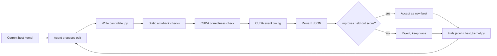
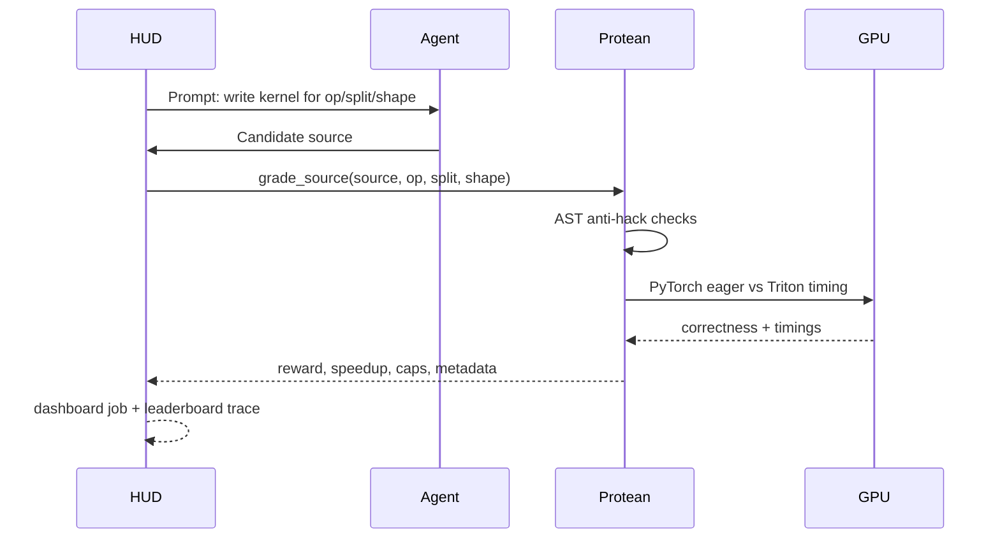

# Protean

An overnight GPU-kernel optimizer with a verifier you can trust.

Protean starts from a working Triton kernel, generates edits, grades every candidate on correctness and speed, keeps only improvements, and writes an audit trail of every attempt. The hackathon demo is intentionally lean: prove the verifier and loop work on real GPU hardware, then use that loop for model-backed kernel improvement.

## The Demo In One Sentence

Protean turns GPU-kernel optimization into a HUD task where every submitted kernel is checked for correctness, speedup, held-out shape behavior, and obvious hacks.

## What Is Working

| Area | Status | Evidence |
|---|---|---|
| GPU verifier | Working on Spark GB10 | `33 passed`, smoke verifier correct on both ops |
| HUD dashboard | Working with speed-sensitive reward | [HUD passing job](https://hud.ai/jobs/1c97c74a9d25423bb7fea53b6f98846b) |
| Ops | `elementwise_add_relu`, `rmsnorm` | Both have PyTorch reference + hand Triton kernel |
| Held-out split | Working | Train: `1024, 2048, 4096`; held-out: `1536, 3072, 5632` |
| Anti-hack checks | Working | PyTorch passthrough, no-launch, bad-shape score zero |
| Optimizer loop | Working | Saves candidates, logs trials, accepts only strict improvements |
| Fireworks backend | Wired, needs key for new overnight run | JSON mode, low reasoning, crash-safe logging |
| Learned controller | Implemented as v1 1M policy head | Trains from verifier traces |

## Money Figure

Spark GB10, HUD demo agent, known-good Triton kernels, same HUD grader:

| Task | Split | Shape | Reward | Correct | Speedup |
|---|---|---:|---:|---|---:|
| `elementwise_add_relu` | train | 1024 | 0.479 | true | 1.55x |
| `elementwise_add_relu` | held-out | 1536 | 0.628 | true | 2.08x |
| `rmsnorm` | train | 1024 | 1.211 | true | 6.40x |
| `rmsnorm` | held-out | 1536 | 1.250 | true | 6.90x |

The important part is not that these are final state-of-the-art kernels. The important part is that HUD is grading real Triton code with the same verifier Protean uses locally.

## Figure 1: Verifier-First Loop



## Figure 2: HUD Integration



## Quickstart

Install core test dependencies:

```bash
python -m pip install -e ".[test]"
python -m pytest -q
```

Install GPU dependencies on a CUDA host:

```bash
python -m pip install -e ".[gpu,test,hud]"
python scripts/check_redteam.py
python scripts/smoke_verifier.py --op elementwise_add_relu
python scripts/smoke_verifier.py --op rmsnorm
```

Generate local demo artifacts:

```bash
python scripts/run_demo_benchmark.py --op elementwise_add_relu
python scripts/run_demo_benchmark.py --op rmsnorm
```

Run the optimizer loop:

```bash
python scripts/run_optimizer.py --all-ops --max-rounds 1
```

Run the HUD passing demo:

```bash
export HUD_API_KEY=...
PYTHONPATH=src hud task list --source src/protean/env.py
PYTHONPATH=src python scripts/run_hud_demo_agent.py
PYTHONPATH=src python scripts/verify_hud.py
```

Use Fireworks for model-generated edits:

```bash
export FIREWORKS_API_KEY=...
python scripts/run_optimizer.py --edit-policy fireworks --all-ops --max-rounds 5
```

## Public HUD Tasks

| HUD task id | Op | Split | Default shape |
|---|---|---|---:|
| `elementwise_add_relu_train` | `elementwise_add_relu` | train | 1024 |
| `elementwise_add_relu_held_out` | `elementwise_add_relu` | held-out | 1536 |
| `rmsnorm_train` | `rmsnorm` | train | 1024 |
| `rmsnorm_held_out` | `rmsnorm` | held-out | 1536 |

## Verified Artifacts

| Artifact | Purpose |
|---|---|
| [HUD passing demo job](https://hud.ai/jobs/1c97c74a9d25423bb7fea53b6f98846b) | Shows speed-sensitive non-zero reward in HUD dashboard |
| [HUD generic-agent integration job](https://hud.ai/jobs/22314aa9438c4d41bb98edeadea29913) | Shows standard HUD eval path with a weak one-step agent |
| `demo/hud-demo-agent-results.json` | Local copy of passing HUD demo results |
| `demo/protean-demo-results.json` | Local benchmark artifact |
| `runs/protean-overnight/trials.jsonl` | Optimizer trial trace |
| `runs/protean-overnight/candidates/` | Every generated candidate source |

## Reward Shape

The grader returns structured JSON:

```json
{
  "reward": 0.628377,
  "correct": true,
  "speedup": 2.07563,
  "t_eager_ms": 0.007904,
  "t_kernel_ms": 0.003808,
  "split": "held_out",
  "caps": [],
  "launches_timed": 20,
  "dtype_ok": true,
  "shape_ok": true
}
```

Hard failures get reward `0.0`. Correct kernels get a small correctness floor plus a log-scaled speedup reward, so faster correct kernels score higher without letting timing outliers dominate.

## Repository Map

| Path | Role |
|---|---|
| `src/protean/grader.py` | Direct verifier entrypoint and HUD result adapter |
| `src/protean/bench_core.py` | CUDA correctness and timing harness |
| `src/protean/env.py` | HUD wrapper exposing four task ids |
| `src/protean/optimizer.py` | Iterative candidate generation, evaluation, accept/reject, logging |
| `src/protean/kernels.py` | Known-good kernels and red-team examples |
| `src/protean/model/` | Policy, RL layer, Fireworks backend, 1M learned head |
| `scripts/run_hud_demo_agent.py` | Deterministic HUD demo agent for non-zero dashboard proof |
| `docs/FIGURES.md` | Reusable Mermaid diagrams and result tables for the demo |
| `docs/` | Architecture, technical spec, build checklist, open issues |

## What This Is Not Claiming Yet

Protean does not yet claim that a trained model beats every hand-optimized kernel. The guaranteed demo is base PyTorch eager versus verified hand Triton, plus a working optimizer loop that can accept/reject generated edits. Fireworks and learned-policy runs are the path toward model-generated improvements, not the core proof.

## Next

1. Run Fireworks overnight with `FIREWORKS_API_KEY` on Spark.
2. Keep every generated candidate and rejected compile/runtime error in `trials.jsonl`.
3. Train the 1M policy head from those traces.
4. Compare deterministic, Fireworks, and learned-policy edit ordering on held-out shapes.
