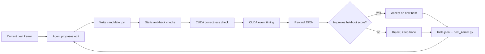
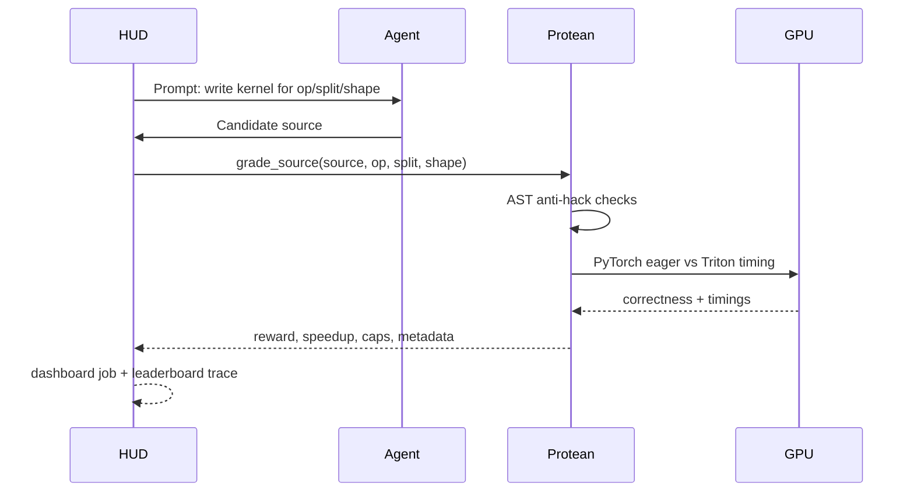
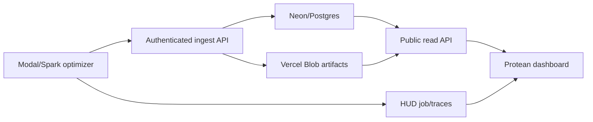

# Protean

An overnight GPU-kernel optimizer with a verifier you can trust.

Protean starts from a working Triton kernel, generates edits, grades every candidate on correctness and speed, keeps only improvements, and writes an audit trail of every attempt. The hackathon demo is intentionally lean: prove the verifier and loop work on real GPU hardware, then use that loop for model-backed kernel improvement.

**Live dashboard:** <https://protean-khaki.vercel.app>  
**Demo video:** <https://youtu.be/qDc0QZqu7q4>


The screenshot above is the Modal B200 run pattern Protean is built around: short bursts to 100% GPU utilization while candidate kernels compile, launch, and benchmark, with the verifier logging correctness, latency, speedup, reward, and accept/reject after every trial.

## The Demo In One Sentence

Protean turns GPU-kernel optimization into a live eval loop: a coding agent edits kernels, the verifier rejects incorrect or hacky submissions, correct faster kernels score higher, and the dashboard shows the improvement curve in real time.

## What The Demo Shows

| Surface | URL | What judges should look for |
|---|---|---|
| Production dashboard | <https://protean-khaki.vercel.app> | Speedup curve rising, latency falling, accepted/rejected candidate history, GPU samples, Blob-backed source artifact |
| Latest showcase run | <https://protean-khaki.vercel.app/runs/live-showcase-20260621-124855> | 24 trial rows, 17 accepted, 7 rejected, best speedup `4.62x`, best latency `0.031 ms` |
| HUD control plane | <https://hud.ai/tasksets/3f2d2423-72d4-4541-bb18-b78e31151676> | Stable taskset rows for verifier-backed kernel tasks |
| Demo video | <https://youtu.be/qDc0QZqu7q4> | End-to-end visual walkthrough |

The important behavior is not a single hand-picked number. It is the loop: incorrect kernels get `0`, correct-but-slower kernels are logged but not accepted, and faster correct kernels push the best-so-far curve upward.

## What Is Working

| Area | Status | Evidence |
|---|---|---|
| GPU verifier | Working on Spark GB10 | `49 passed, 1 skipped`, smoke verifier correct on all public ops |
| HUD dashboard | Working as eval control plane | Stable tasks, one-job optimizer streaming, grouped rollouts |
| Ops | `elementwise_add_relu`, `rmsnorm`, `softmax_rows` | PyTorch reference + hand Triton kernel for each |
| Held-out split | Working | Train: `1024, 2048, 4096`; held-out: `1536, 3072, 5632` |
| Anti-hack checks | Working | PyTorch passthrough, no-launch, bad-shape score zero |
| Optimizer loop | Working | Saves candidates, logs trials, accepts only strict improvements |
| HUD trial streaming | Working | Optional `--stream-hud` streams every trial into one HUD job/session |
| Fireworks backend | Wired | JSON mode, low reasoning, crash-safe logging, HUD streaming ready |
| Learned controller | Implemented as v1 1M policy head | Trains from verifier traces |
| Vercel dashboard | Working in production | Neon/Postgres, Vercel Blob, authenticated ingest, public read dashboard |

## Money Figure

Spark GB10, HUD demo agent, known-good Triton kernels, same HUD grader:

| Task | Split | Shape | Reward | Correct | Speedup |
|---|---|---:|---:|---|---:|
| `elementwise_add_relu` | train | 1024 | 0.482 | true | 1.56x |
| `elementwise_add_relu` | held-out | 1536 | 0.628 | true | 2.08x |
| `rmsnorm` | train | 1024 | 1.211 | true | 6.40x |
| `rmsnorm` | held-out | 1536 | 1.255 | true | 6.97x |

The important part is not that these are final state-of-the-art kernels. The important part is that HUD is grading real Triton code with the same verifier Protean uses locally.

## Figure 1: Verifier-First Loop



## Figure 2: HUD Integration



## Figure 3: Production Data Path



The dashboard is not static marketing copy. It reads the production database and Blob artifacts, so every run page can show trial rows, accepted/rejected history, GPU utilization samples, candidate source links, and HUD proof links.

## Quickstart

Install core test dependencies:

```bash
python -m pip install -e ".[test]"
python -m pytest -q
```

Install GPU dependencies on a CUDA host:

```bash
python -m pip install -e ".[gpu,test,hud]"
python scripts/check_redteam.py
python scripts/smoke_verifier.py --op elementwise_add_relu
python scripts/smoke_verifier.py --op rmsnorm
```

Generate local demo artifacts:

```bash
python scripts/run_demo_benchmark.py --op elementwise_add_relu
python scripts/run_demo_benchmark.py --op rmsnorm
```

Run the optimizer loop:

```bash
python scripts/run_optimizer.py --all-ops --max-rounds 1
```

Stream every optimizer trial to one HUD job:

```bash
python scripts/run_optimizer.py \
  --edit-policy local \
  --op elementwise_add_relu \
  --max-rounds 1 \
  --stream-hud \
  --hud-job-name protean-smoke
```

HUD auth can come from `export HUD_API_KEY=...` or `hud set HUD_API_KEY=...`. Do not `source .env`; the project `.env` may contain non-shell-safe notes.

This opens one HUD job for the optimizer run, then records each candidate as HUD traces under that job. The local `trials.jsonl` stays the continuous audit log, and each trial row records either `hud_stream.job_url` or `hud_stream_error`.

Run the real overnight server job on Spark:

```bash
ssh spark
cd ~/protean
git pull origin main
export FIREWORKS_API_KEY=...
export HUD_API_KEY=...   # or run: hud set HUD_API_KEY=...
DURATION_HOURS=8 POLICY=fireworks HUD_GROUP=1 \
  scripts/start_overnight_hud_optimizer.sh
```

This starts a detached 8-hour optimizer process. It keeps running after the SSH
session disconnects, streams each trial to one HUD job, and writes the local
audit trail under `runs/protean-overnight-<timestamp>/`. With `--all-ops`, the
launcher splits `DURATION_HOURS` across the registered ops so the full server
job stays near the requested wall-clock budget.

Check progress from another shell:

```bash
ssh spark
cd ~/protean
scripts/status_overnight_hud_optimizer.sh runs/protean-overnight-<timestamp>
tail -f runs/protean-overnight-<timestamp>/overnight.log
```

The files that matter after the run are:

| File | Purpose |
|---|---|
| `overnight.log` | Long-running process stdout/stderr |
| `pid` | Server process id |
| `<op>/trials.jsonl` | Full trial log with prompt, edit, cost, reward, HUD stream result |
| `<op>/improvements_<op>.jsonl` | Compact reward/speedup curve for charts |
| `<op>/summary_<op>.json` | Final best score, accepted count, stop reason, HUD job URL |
| `<op>/candidates/*.py` | Every candidate kernel source, including failures |

Measure reward spread for trainability:

```bash
python scripts/run_optimizer.py \
  --edit-policy local \
  --op elementwise_add_relu \
  --max-rounds 1 \
  --stream-hud \
  --hud-job-name protean-group-smoke \
  --hud-group 3
```

Run the HUD passing demo:

```bash
PYTHONPATH=src hud task list --source src/protean/env.py
PYTHONPATH=src python scripts/run_hud_demo_agent.py
PYTHONPATH=src python scripts/verify_hud.py
```

Use Fireworks plus the 1M controller trace layer for the live optimizer demo:

```bash
export FIREWORKS_API_KEY=...
python scripts/run_hud_optimizer_agent.py \
  --policy fireworks \
  --controller outputs/policy_head.pt \
  --all-ops \
  --max-rounds 50 \
  --group 4 \
  --job-name protean-live-kernel-optimizer
```

If Fireworks is unavailable, use the deterministic fallback:

```bash
python scripts/run_hud_optimizer_agent.py \
  --policy local \
  --all-ops \
  --max-rounds 1 \
  --group 2 \
  --job-name protean-live-fallback
```

Sync Protean's taskset to HUD:

```bash
hud deploy . --no-env
hud sync tasks protean-kernel-optimizer src/protean/env.py --yes
hud eval protean-kernel-optimizer claude --full --group 3 --max-concurrent 4
```

## Public HUD Tasks

Protean publishes a large deterministic HUD grid:

```text
12 ops x 2 splits x 42 shape variants = 1008 HUD task rows
```

Task ids follow:

```text
<op>_<split>_s<shape>_v<variant>
```

Examples:

| HUD task id | Op | Split | Shape |
|---|---|---|---:|
| `elementwise_add_relu_train_s1024_v04` | `elementwise_add_relu` | train | 1024 |
| `elementwise_add_relu_held_out_s1553_v06` | `elementwise_add_relu` | held-out | 1553 |
| `rmsnorm_train_s2048_v12` | `rmsnorm` | train | 2048 |
| `rmsnorm_held_out_s3089_v18` | `rmsnorm` | held-out | 3089 |
| `softmax_rows_train_s4096_v28` | `softmax_rows` | train | 4096 |
| `prefix_scan_held_out_s6033_v41` | `prefix_scan` | held-out | 6033 |

## HUD Control Plane

Protean uses HUD as the public eval/training control plane:

| HUD surface | Protean usage |
|---|---|
| Tasksets | 1008 stable task rows: 12 ops times train/held-out times 42 shape variants |
| Jobs | One optimizer run opens one HUD job/session |
| Traces | Every candidate records model response, 1M controller decision when available, saved file, AST check, compile status, correctness, timing, reward, and accept/reject |
| Subscores | HUD-normalized `0..1` components for reward, correctness, speedup, held-out, anti-hack, and compile success |
| Groups | `--hud-group N` repeats each HUD task per candidate to inspect reward spread |
| Training | HUD traces can feed GRPO once grouped rewards show useful variance |

HUD-facing reward is normalized to `0..1`. The raw Protean reward remains in `info.protean_reward_raw` and in local `trials.jsonl`.

## Vercel Dashboard

Protean also includes a public-read Next.js dashboard in `apps/web` for run
history, live trial curves, GPU utilization, candidate artifacts, and HUD links.
Deploy it on Vercel with `apps/web` as the project root directory. See
`docs/VERCEL_DASHBOARD.md` for environment variables and the Spark/Modal ingest
command.

Production status:

| Component | Status |
|---|---|
| Vercel deployment | Ready at <https://protean-khaki.vercel.app> |
| Neon/Postgres | Connected via `DATABASE_URL` |
| Vercel Blob | Connected via `BLOB_READ_WRITE_TOKEN` |
| Ingest auth | `PROTEAN_INGEST_TOKEN`; unauthenticated writes return `401` |
| Public reads | `/`, `/runs`, `/api/runs`, and `/api/runs/[id]` return database-backed data |

Verified showcase run:

| Metric | Value |
|---|---:|
| Run id | `live-showcase-20260621-124855` |
| Trials | 24 |
| GPU samples | 24 |
| Blob artifacts | 1 |
| Accepted / rejected | 17 / 7 |
| Best speedup | 4.62x |
| Best latency | 0.031 ms |

## Verified Artifacts

| Artifact | Purpose |
|---|---|
| [Current HUD environment](https://hud.ai/environments/32bb1f0c-0737-4a58-8a5e-5c9ec8a2f01b) | Deployed and introspected Protean HUD environment with 3 templates |
| [Current HUD taskset](https://hud.ai/tasksets/3f2d2423-72d4-4541-bb18-b78e31151676) | Synced `protean-kernel-optimizer` taskset; current source defines 1008 rows |
| [Requested HUD environment](https://hud.ai/environments/9907b272-ef58-4f57-9cd3-5dbcb37dd51e) | Earlier public environment URL supplied for the demo |
| [Requested HUD taskset](https://hud.ai/tasksets/6d2feb10-b23c-4928-a1f9-e8b53db364d7) | Earlier public taskset URL supplied for the demo |
| [HUD all-ops grouped live job](https://hud.ai/jobs/3eda0cb665df40f6a3f25a89460819ae) | Spark `group=2` live optimizer run across all three ops |
| [HUD trace smoke job](https://hud.ai/jobs/53014ddee1c34b60b229e700532793d3) | One-op real trace smoke with no HUD auth errors |
| `demo/powered-eval-200.json` | 200-task powered eval artifact with bootstrap CI and sign test |
| [HUD control-plane smoke job](https://hud.ai/jobs/4e03f95d8eb440989758d9b6d37dc183) | One Spark optimizer run streamed five trials into one grouped HUD job |
| [HUD passing demo job](https://hud.ai/jobs/5a3ddc3f24a748d9abda38866bccb503) | Shows speed-sensitive non-zero reward in HUD dashboard |
| [HUD generic-agent integration job](https://hud.ai/jobs/22314aa9438c4d41bb98edeadea29913) | Shows standard HUD eval path with a weak one-step agent |
| `demo/hud-demo-agent-results.json` | Local copy of passing HUD demo results |
| `demo/protean-demo-results.json` | Local benchmark artifact |
| `runs/protean-overnight/trials.jsonl` | Optimizer trial trace |
| `runs/protean-overnight/candidates/` | Every generated candidate source |

## Reward Shape

The grader returns structured JSON:

```json
{
  "reward": 0.628377,
  "correct": true,
  "speedup": 2.07563,
  "t_eager_ms": 0.007904,
  "t_kernel_ms": 0.003808,
  "split": "held_out",
  "caps": [],
  "launches_timed": 20,
  "dtype_ok": true,
  "shape_ok": true
}
```

Hard failures get reward `0.0`. Correct kernels get a small correctness floor plus a log-scaled speedup reward, so faster correct kernels score higher without letting timing outliers dominate.

## Repository Map

| Path | Role |
|---|---|
| `src/protean/grader.py` | Direct verifier entrypoint and HUD result adapter |
| `src/protean/bench_core.py` | CUDA correctness and timing harness |
| `src/protean/env.py` | HUD wrapper exposing the public task grid |
| `src/protean/hud_stream.py` | One-job HUD streaming for optimizer candidates, trace steps, grouped rollouts |
| `src/protean/optimizer.py` | Iterative candidate generation, evaluation, accept/reject, logging |
| `src/protean/kernels.py` | Known-good kernels and red-team examples |
| `src/protean/model/` | Policy, RL layer, Fireworks backend, 1M learned head |
| `scripts/run_hud_demo_agent.py` | Deterministic HUD demo agent for non-zero dashboard proof |
| `manifest_v1.jsonl` | Pinned training task manifest for reproducible GRPO rollouts |
| `train/callbacks.py` | Cost/time/reward safeguards plus live reward curve serialization |
| `scripts/plot_curve.py` | Plots real `outputs/train_history.json` data, no mock curve |
| `docs/FIGURES.md` | Reusable Mermaid diagrams and result tables for the demo |
| `docs/` | Architecture, technical spec, build checklist, open issues |

## Kernel Tasks In Plain English

Protean is not tied to one model family. The verifier/task layer is deliberately shaped around kernels companies actually optimize in production:

| Task | Reads as | Plain-English description |
|---|---|---|
| `elementwise_add_relu` | fused elementwise op | Adds two tensors and applies ReLU in one pass. A small but useful verifier smoke test. |
| `rmsnorm` | normalization | Computes RMS normalization used in many transformer blocks. |
| `softmax_rows` | row-wise softmax | Converts logits to probabilities per row; common in attention and routing. |
| `matmul_tile` | tiled matrix multiply | The core dense linear algebra primitive behind linear layers. |
| `attention_softmax` | attention normalization piece | The softmax-like part of attention where stability and memory traffic matter. |
| `layernorm` | normalization | Centers/scales activations across a feature dimension. |
| `fused_mlp` | fused feed-forward block | Fuses pieces of an MLP path to reduce memory round-trips. |
| `quantize_dequant` | quantization round trip | Packs/unpacks values for lower-precision inference or storage. |
| `moe_routing` | mixture-of-experts routing | Picks experts/tokens efficiently without breaking correctness. |
| `embedding_lookup` | table lookup | Fetches rows from embedding tables with coalesced memory access. |
| `sum_reduction` | reduction | Sums many values quickly and correctly. |
| `prefix_scan` | scan | Computes cumulative values where ordering matters. |

### Tensor Glossary

| Symbol | What it usually means in Protean tasks |
|---|---|
| `x`, `a`, `b` | Input tensors |
| `y`, `out` | Output tensor |
| `m`, `n`, `k` | Matrix or vector dimensions |
| `stride_*` | How far to move in memory for the next logical element |
| `BLOCK`, `BLOCK_M`, `BLOCK_N`, `BLOCK_K` | Compile-time tile sizes used by Triton kernels |
| `pid` | Triton program id; selects which tile a program instance owns |
| `mask` | Bounds check for tiles that cross tensor edges |

### Reward Rules

The reward is intentionally simple:

1. Incorrect output: reward `0`.
2. Shape/dtype mismatch: reward `0`.
3. Obvious hacks such as PyTorch passthrough or no Triton launch: reward `0` or capped.
4. Correct but slower kernels are logged, but they do not become the new best.
5. Correct faster kernels get higher reward and can exceed `1.0` in Protean's raw score.

That makes the live chart honest: rising speedup means the verifier accepted a faster correct kernel, not just that the agent found a way to game the metric.

## What This Is Not Claiming Yet

Protean does not yet claim that a trained model beats every hand-optimized kernel. The guaranteed demo is base PyTorch eager versus verified hand Triton, plus a working optimizer loop that can accept/reject generated edits. Fireworks and learned-policy runs are the path toward model-generated improvements, not the core proof.

## Next

1. Run Fireworks overnight with `FIREWORKS_API_KEY` and `HUD_API_KEY` on Spark.
2. Stream every candidate to one HUD job with `--stream-hud --hud-job-name protean-overnight`.
3. Train the 1M policy head from those traces.
4. Optional stretch: run GRPO with the pinned manifest, curriculum, calibration, and reward-curve logger.
5. Compare deterministic, Fireworks, learned-policy, and GRPO edit ordering on held-out shapes.
