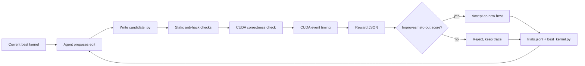
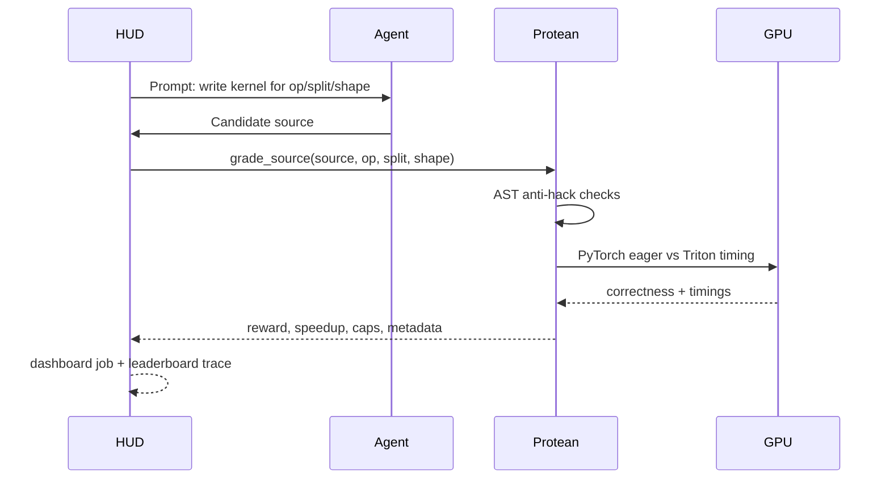

# Protean

An overnight GPU-kernel optimizer with a verifier you can trust.

Protean starts from a working Triton kernel, generates edits, grades every candidate on correctness and speed, keeps only improvements, and writes an audit trail of every attempt. The hackathon demo is intentionally lean: prove the verifier and loop work on real GPU hardware, then use that loop for model-backed kernel improvement.

## The Demo In One Sentence

Protean turns GPU-kernel optimization into a HUD task where every submitted kernel is checked for correctness, speedup, held-out shape behavior, and obvious hacks.

## What Is Working

| Area | Status | Evidence |
|---|---|---|
| GPU verifier | Working on Spark GB10 | `49 passed, 1 skipped`, smoke verifier correct on all public ops |
| HUD dashboard | Working as eval control plane | Stable tasks, one-job optimizer streaming, grouped rollouts |
| Ops | `elementwise_add_relu`, `rmsnorm`, `softmax_rows` | PyTorch reference + hand Triton kernel for each |
| Held-out split | Working | Train: `1024, 2048, 4096`; held-out: `1536, 3072, 5632` |
| Anti-hack checks | Working | PyTorch passthrough, no-launch, bad-shape score zero |
| Optimizer loop | Working | Saves candidates, logs trials, accepts only strict improvements |
| HUD trial streaming | Working | Optional `--stream-hud` streams every trial into one HUD job/session |
| Fireworks backend | Wired | JSON mode, low reasoning, crash-safe logging, HUD streaming ready |
| Learned controller | Implemented as v1 1M policy head | Trains from verifier traces |

## Money Figure

Spark GB10, HUD demo agent, known-good Triton kernels, same HUD grader:

| Task | Split | Shape | Reward | Correct | Speedup |
|---|---|---:|---:|---|---:|
| `elementwise_add_relu` | train | 1024 | 0.482 | true | 1.56x |
| `elementwise_add_relu` | held-out | 1536 | 0.628 | true | 2.08x |
| `rmsnorm` | train | 1024 | 1.211 | true | 6.40x |
| `rmsnorm` | held-out | 1536 | 1.255 | true | 6.97x |

The important part is not that these are final state-of-the-art kernels. The important part is that HUD is grading real Triton code with the same verifier Protean uses locally.

## Figure 1: Verifier-First Loop



## Figure 2: HUD Integration



## Quickstart

Install core test dependencies:

```bash
python -m pip install -e ".[test]"
python -m pytest -q
```

Install GPU dependencies on a CUDA host:

```bash
python -m pip install -e ".[gpu,test,hud]"
python scripts/check_redteam.py
python scripts/smoke_verifier.py --op elementwise_add_relu
python scripts/smoke_verifier.py --op rmsnorm
```

Generate local demo artifacts:

```bash
python scripts/run_demo_benchmark.py --op elementwise_add_relu
python scripts/run_demo_benchmark.py --op rmsnorm
```

Run the optimizer loop:

```bash
python scripts/run_optimizer.py --all-ops --max-rounds 1
```

Stream every optimizer trial to one HUD job:

```bash
python scripts/run_optimizer.py \
  --edit-policy local \
  --op elementwise_add_relu \
  --max-rounds 1 \
  --stream-hud \
  --hud-job-name protean-smoke
```

HUD auth can come from `export HUD_API_KEY=...` or `hud set HUD_API_KEY=...`. Do not `source .env`; the project `.env` may contain non-shell-safe notes.

This opens one HUD job for the optimizer run, then records each candidate as HUD traces under that job. The local `trials.jsonl` stays the continuous audit log, and each trial row records either `hud_stream.job_url` or `hud_stream_error`.

Measure reward spread for trainability:

```bash
python scripts/run_optimizer.py \
  --edit-policy local \
  --op elementwise_add_relu \
  --max-rounds 1 \
  --stream-hud \
  --hud-job-name protean-group-smoke \
  --hud-group 3
```

Run the HUD passing demo:

```bash
PYTHONPATH=src hud task list --source src/protean/env.py
PYTHONPATH=src python scripts/run_hud_demo_agent.py
PYTHONPATH=src python scripts/verify_hud.py
```

Use Fireworks plus the 1M controller trace layer for the live optimizer demo:

```bash
export FIREWORKS_API_KEY=...
python scripts/run_hud_optimizer_agent.py \
  --policy fireworks \
  --controller outputs/policy_head.pt \
  --all-ops \
  --max-rounds 50 \
  --group 4 \
  --job-name protean-live-kernel-optimizer
```

If Fireworks is unavailable, use the deterministic fallback:

```bash
python scripts/run_hud_optimizer_agent.py \
  --policy local \
  --all-ops \
  --max-rounds 1 \
  --group 2 \
  --job-name protean-live-fallback
```

Sync Protean's taskset to HUD:

```bash
hud deploy . --no-env
hud sync tasks protean-kernel-optimizer src/protean/env.py --yes
hud eval protean-kernel-optimizer claude --full --group 3 --max-concurrent 4
```

## Public HUD Tasks

| HUD task id | Op | Split | Default shape |
|---|---|---|---:|
| `elementwise_add_relu_train` | `elementwise_add_relu` | train | 1024 |
| `elementwise_add_relu_held_out` | `elementwise_add_relu` | held-out | 1536 |
| `rmsnorm_train` | `rmsnorm` | train | 1024 |
| `rmsnorm_held_out` | `rmsnorm` | held-out | 1536 |
| `softmax_rows_train` | `softmax_rows` | train | 1024 |
| `softmax_rows_held_out` | `softmax_rows` | held-out | 1536 |

## HUD Control Plane

Protean uses HUD as the public eval/training control plane:

| HUD surface | Protean usage |
|---|---|
| Tasksets | Six stable task rows: three ops times train/held-out |
| Jobs | One optimizer run opens one HUD job/session |
| Traces | Every candidate records model response, 1M controller decision when available, saved file, AST check, compile status, correctness, timing, reward, and accept/reject |
| Subscores | HUD-normalized `0..1` components for reward, correctness, speedup, held-out, anti-hack, and compile success |
| Groups | `--hud-group N` repeats each HUD task per candidate to inspect reward spread |
| Training | HUD traces can feed GRPO once grouped rewards show useful variance |

HUD-facing reward is normalized to `0..1`. The raw Protean reward remains in `info.protean_reward_raw` and in local `trials.jsonl`.

## Verified Artifacts

| Artifact | Purpose |
|---|---|
| [Current HUD environment](https://hud.ai/environments/32bb1f0c-0737-4a58-8a5e-5c9ec8a2f01b) | Deployed and introspected Protean HUD environment with 3 templates |
| [Current HUD taskset](https://hud.ai/tasksets/3f2d2423-72d4-4541-bb18-b78e31151676) | Synced `protean-kernel-optimizer` taskset with all six rows |
| [Requested HUD environment](https://hud.ai/environments/9907b272-ef58-4f57-9cd3-5dbcb37dd51e) | Earlier public environment URL supplied for the demo |
| [Requested HUD taskset](https://hud.ai/tasksets/6d2feb10-b23c-4928-a1f9-e8b53db364d7) | Earlier public taskset URL supplied for the demo |
| [HUD all-ops grouped live job](https://hud.ai/jobs/3eda0cb665df40f6a3f25a89460819ae) | Spark `group=2` live optimizer run across all three ops |
| [HUD trace smoke job](https://hud.ai/jobs/53014ddee1c34b60b229e700532793d3) | One-op real trace smoke with no HUD auth errors |
| `demo/powered-eval-200.json` | 200-task powered eval artifact with bootstrap CI and sign test |
| [HUD control-plane smoke job](https://hud.ai/jobs/4e03f95d8eb440989758d9b6d37dc183) | One Spark optimizer run streamed five trials into one grouped HUD job |
| [HUD passing demo job](https://hud.ai/jobs/5a3ddc3f24a748d9abda38866bccb503) | Shows speed-sensitive non-zero reward in HUD dashboard |
| [HUD generic-agent integration job](https://hud.ai/jobs/22314aa9438c4d41bb98edeadea29913) | Shows standard HUD eval path with a weak one-step agent |
| `demo/hud-demo-agent-results.json` | Local copy of passing HUD demo results |
| `demo/protean-demo-results.json` | Local benchmark artifact |
| `runs/protean-overnight/trials.jsonl` | Optimizer trial trace |
| `runs/protean-overnight/candidates/` | Every generated candidate source |

## Reward Shape

The grader returns structured JSON:

```json
{
  "reward": 0.628377,
  "correct": true,
  "speedup": 2.07563,
  "t_eager_ms": 0.007904,
  "t_kernel_ms": 0.003808,
  "split": "held_out",
  "caps": [],
  "launches_timed": 20,
  "dtype_ok": true,
  "shape_ok": true
}
```

Hard failures get reward `0.0`. Correct kernels get a small correctness floor plus a log-scaled speedup reward, so faster correct kernels score higher without letting timing outliers dominate.

## Repository Map

| Path | Role |
|---|---|
| `src/protean/grader.py` | Direct verifier entrypoint and HUD result adapter |
| `src/protean/bench_core.py` | CUDA correctness and timing harness |
| `src/protean/env.py` | HUD wrapper exposing six task ids |
| `src/protean/hud_stream.py` | One-job HUD streaming for optimizer candidates, trace steps, grouped rollouts |
| `src/protean/optimizer.py` | Iterative candidate generation, evaluation, accept/reject, logging |
| `src/protean/kernels.py` | Known-good kernels and red-team examples |
| `src/protean/model/` | Policy, RL layer, Fireworks backend, 1M learned head |
| `scripts/run_hud_demo_agent.py` | Deterministic HUD demo agent for non-zero dashboard proof |
| `manifest_v1.jsonl` | Pinned training task manifest for reproducible GRPO rollouts |
| `train/callbacks.py` | Cost/time/reward safeguards plus live reward curve serialization |
| `scripts/plot_curve.py` | Plots real `outputs/train_history.json` data, no mock curve |
| `docs/FIGURES.md` | Reusable Mermaid diagrams and result tables for the demo |
| `docs/` | Architecture, technical spec, build checklist, open issues |

## What This Is Not Claiming Yet

Protean does not yet claim that a trained model beats every hand-optimized kernel. The guaranteed demo is base PyTorch eager versus verified hand Triton, plus a working optimizer loop that can accept/reject generated edits. Fireworks and learned-policy runs are the path toward model-generated improvements, not the core proof.

## Next

1. Run Fireworks overnight with `FIREWORKS_API_KEY` and `HUD_API_KEY` on Spark.
2. Stream every candidate to one HUD job with `--stream-hud --hud-job-name protean-overnight`.
3. Train the 1M policy head from those traces.
4. Optional stretch: run GRPO with the pinned manifest, curriculum, calibration, and reward-curve logger.
5. Compare deterministic, Fireworks, learned-policy, and GRPO edit ordering on held-out shapes.
