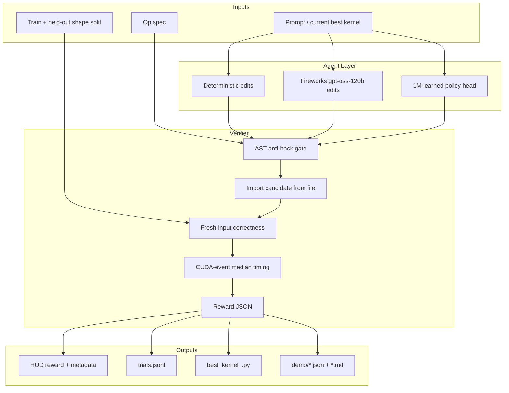
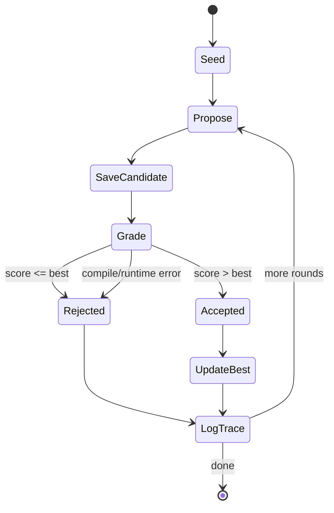

# Architecture

Protean has one load-bearing idea: make the verifier the center of the system. Every agent, learned policy, HUD task, and benchmark path calls the same grading code.

## System Figure



## Core Modules

| Module | Responsibility |
|---|---|
| `src/protean/grader.py` | Public `grade_source(...)` API. Used by HUD, scripts, tests, optimizer. |
| `src/protean/bench_core.py` | CUDA input generation, PyTorch eager baseline, candidate import, correctness, CUDA-event timing. |
| `src/protean/rewards.py` | Reward shaping and public grade payload. |
| `src/protean/anti_hack.py` | Cheap static rejection of PyTorch passthrough and unsafe imports/calls. |
| `src/protean/splits.py` | Frozen train and held-out shapes plus powered future sampler. |
| `src/protean/task_catalog.py` | Op registry: dtype, tolerance, prompt path, speedup target. |
| `src/protean/kernels.py` | Known-good hand Triton kernels and red-team examples. |
| `src/protean/env.py` | HUD wrapper around the same grader. |
| `src/protean/optimizer.py` | Candidate loop: generate, write, grade, score, accept/reject, log. |

## Model Layer

Everything model-related lives in `src/protean/model/`.

| File | Role |
|---|---|
| `policy.py` | Candidate edit dataclass and deterministic block-size edits. |
| `fireworks_policy.py` | Fireworks OpenAI-compatible backend. Uses JSON mode and low reasoning effort. |
| `tiny_policy.py` | 1M-parameter learned policy head trained from verifier traces. |
| `rl_layer.py` | Candidate score tuple and strict improvement acceptance rule. |
| `harness.py` | Benchmark knob policy for candidate evaluations. |
| `prompts/kernel_optimizer.md` | Prompt contract for future model-backed kernel optimizer. |
| `configs/*.json` | Active policy descriptions. |

## Runtime Flow



Candidate evaluation errors are not fatal. The optimizer catches verifier exceptions, logs `eval_error`, assigns zero score, rejects the candidate, and continues.

## HUD Path

`src/protean/env.py` exposes four concrete HUD tasks:

| Task | Op | Split |
|---|---|---|
| `elementwise_add_relu_train` | `elementwise_add_relu` | train |
| `elementwise_add_relu_held_out` | `elementwise_add_relu` | held-out |
| `rmsnorm_train` | `rmsnorm` | train |
| `rmsnorm_held_out` | `rmsnorm` | held-out |

The HUD wrapper does not duplicate grading logic. It calls:

```python
grade_source(source, op=op, split=split, shape=shape)
```

## Verified Spark Commands

```bash
cd /home/alhinai/protean
. /home/alhinai/.venvs/protean/bin/activate
python -m pytest -q
python scripts/check_redteam.py
python scripts/smoke_verifier.py --op elementwise_add_relu
python scripts/smoke_verifier.py --op rmsnorm
python scripts/run_optimizer.py --all-ops --max-rounds 1
HUD_API_KEY=... PYTHONPATH=src python scripts/run_hud_demo_agent.py
```

## Design Boundaries

- HUD is a wrapper, not a second grader.
- The optimizer never accepts a candidate that fails evaluation.
- The model layer can propose edits, but the verifier decides.
- GRPO is not required for the v1 demo.
- Fireworks is optional and requires `FIREWORKS_API_KEY`.
