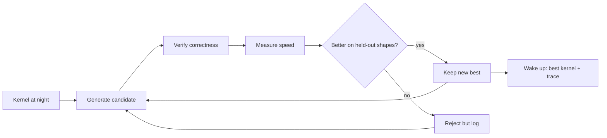
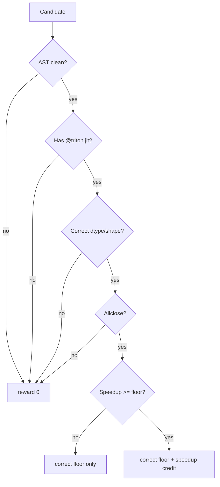
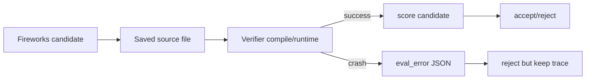

# Figures

Use these figures in the demo, README, or slides.

## Figure 1: What Protean Does Overnight



## Figure 2: Reward Gates



## Figure 3: Spark GB10 Passing HUD Results

| Task | Train reward | Held-out reward | Train speedup | Held-out speedup |
|---|---:|---:|---:|---:|
| `elementwise_add_relu` | 0.482 | 0.628 | 1.56x | 2.08x |
| `rmsnorm` | 1.211 | 1.255 | 6.40x | 6.97x |
| `softmax_rows` | — | — | — | not yet benchmarked |

`softmax_rows` is integrated but not yet measured for the Money Figure.

HUD job: https://hud.ai/jobs/5a3ddc3f24a748d9abda38866bccb503

## Figure 4: HUD Control-Plane Smoke

Spark GB10, local edit policy, one optimizer run, one HUD job:

| Metric | Value |
|---|---:|
| HUD job | https://hud.ai/jobs/4e03f95d8eb440989758d9b6d37dc183 |
| Trials streamed | 5 |
| Group size | 2 |
| Rows per trial | 4 |
| HUD trace ids | 20 |
| Accepted trials | 1 |
| Reward standard deviation | 0.037614 |

HUD platform:

| Surface | URL |
|---|---|
| Environment | https://hud.ai/environments/9907b272-ef58-4f57-9cd3-5dbcb37dd51e |
| Taskset | https://hud.ai/tasksets/6d2feb10-b23c-4928-a1f9-e8b53db364d7 |

## Figure 5: Optimizer Trace Shape

```json
{
  "event": "trial",
  "edit": "block_size_512",
  "policy": "local_deterministic",
  "source_path": "runs/.../candidates/0001_block_size_512.py",
  "best_score_before": [1.54, 1.29, 3],
  "score": [1.99, 1.30, 3],
  "delta_vs_best": {
    "held_out_speedup": 0.45,
    "reward": 0.01,
    "correct_held_out": 0
  },
  "accepted": true,
  "eval_error": null
}
```

## Figure 5: Crash-Safe Model Edit


