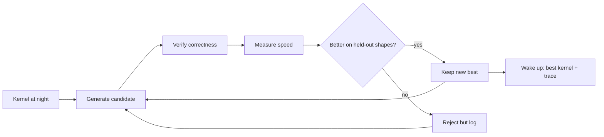
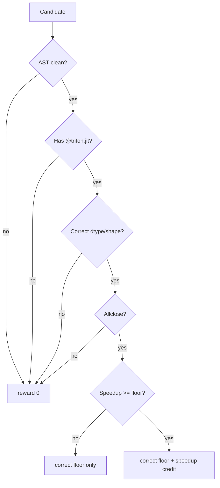
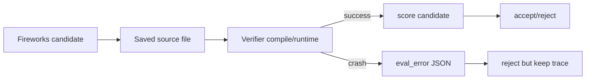
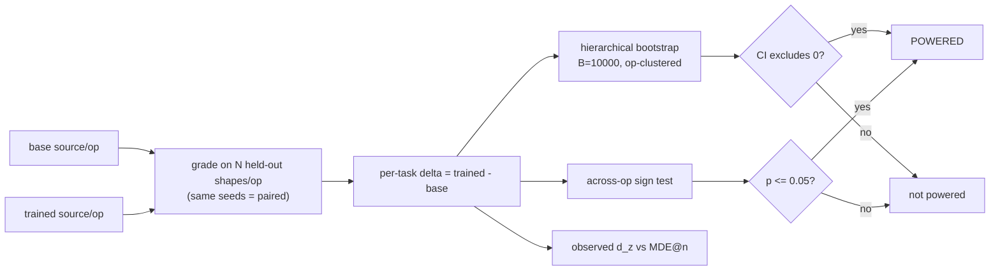
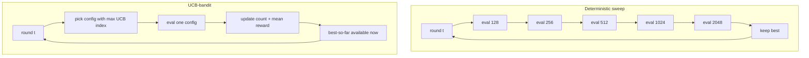

# Figures

Use these figures in the demo, README, or slides.

## Figure 1: What Protean Does Overnight



## Figure 2: Reward Gates



## Figure 3: Spark GB10 Passing HUD Results

| Task | Train reward | Held-out reward | Train speedup | Held-out speedup |
|---|---:|---:|---:|---:|
| `elementwise_add_relu` | 0.482 | 0.628 | 1.56x | 2.08x |
| `rmsnorm` | 1.211 | 1.255 | 6.40x | 6.97x |
| `softmax_rows` | — | — | — | not yet benchmarked |

`softmax_rows` is integrated but not yet measured for the Money Figure.

HUD job: https://hud.ai/jobs/5a3ddc3f24a748d9abda38866bccb503

## Figure 4: HUD Control-Plane Smoke

Spark GB10, local edit policy, one optimizer run, one HUD job:

| Metric | Value |
|---|---:|
| HUD job | https://hud.ai/jobs/4e03f95d8eb440989758d9b6d37dc183 |
| Trials streamed | 5 |
| Group size | 2 |
| Rows per trial | 4 |
| HUD trace ids | 20 |
| Accepted trials | 1 |
| Reward standard deviation | 0.037614 |

HUD platform:

| Surface | URL |
|---|---|
| Environment | https://hud.ai/environments/9907b272-ef58-4f57-9cd3-5dbcb37dd51e |
| Taskset | https://hud.ai/tasksets/6d2feb10-b23c-4928-a1f9-e8b53db364d7 |

## Figure 5: Optimizer Trace Shape

```json
{
  "event": "trial",
  "edit": "block_size_512",
  "policy": "local_deterministic",
  "source_path": "runs/.../candidates/0001_block_size_512.py",
  "best_score_before": [1.54, 1.29, 3],
  "score": [1.99, 1.30, 3],
  "delta_vs_best": {
    "held_out_speedup": 0.45,
    "reward": 0.01,
    "correct_held_out": 0
  },
  "accepted": true,
  "eval_error": null
}
```

## Figure 5b: Crash-Safe Model Edit



## Figure 6: Powered Held-Out Eval — The Money Slide

The verdict is not a single speedup number. `paired_report` (in `eval_protocol.py`)
returns a paired per-task delta, a two-level hierarchical bootstrap CI, an across-op
sign test, and the standardized effect size with its minimum detectable effect. A run
is only `powered` when the 95% CI excludes zero OR the across-op sign test reaches
p <= 0.05.



Report card layout (fields are the literal keys of the `paired_report` dict):

| Field | Meaning | Verdict role |
|---|---|---|
| `gap_mean` | bootstrap point estimate of mean held-out reward delta | headline number |
| `ci95` = (`ci_lo`, `ci_hi`) | 95% hierarchical-bootstrap interval, clustered by op | carries the claim |
| `gap_ci_excludes_zero` | does `ci95` exclude 0 | primary powered gate |
| `observed_dz` | standardized paired effect size | strength of signal |
| `mde_dz_at_n` | minimum detectable effect at this `n_tasks` | is `n` big enough |
| `sign_test` (`positive`/`ops`, `p_one_sided`) | per-op direction agreement | clustering-immune check |
| `sign_test_advisory` | True when `n_ops < 5` | CI carries claim, sign test is auxiliary |
| `powered` | `gap_ci_excludes_zero OR sign_test.p_one_sided <= 0.05` | final verdict |

With only the 3 real ops (`splits.REAL_OPS = elementwise_add_relu, rmsnorm,
softmax_rows`), the sign test is advisory (K=3 < 5, so `sign_test_advisory` is
True; the best attainable one-sided p with all 3 ops positive is 0.125 > 0.05);
the per-task continuous hierarchical bootstrap over the held-out shapes is what
carries the powered verdict.

## Figure 7: Search-Strategy Comparison — Deterministic Sweep vs UCB-Bandit

Today's optimizer (`local_kernel_edits` in `policy.py`) does a flat deterministic sweep:
it re-evaluates all 5 `ACTION_BLOCK_SIZES = (128, 256, 512, 1024, 2048)` every round,
spending equal budget on arms that consistently lose. A UCB-bandit (KernelBand,
arXiv:2511.18868) concentrates budget on the empirically best arm while keeping enough
exploration, and the joint config space can grow without touching the grader, accept
logic, or JSONL trace.

| Aspect | Deterministic sweep (current) | UCB-bandit (KernelBand-style) |
|---|---|---|
| Action space | 5 block sizes | 5 block x 3 num_warps x 3 num_stages = 45 configs |
| Selection rule | round-robin, all arms every round | argmax of `mu_hat + sqrt(2 ln t / n)` |
| Budget on losing arms | equal, every round | decays as visit count rises |
| Anytime best-so-far | only after full sweep | after every single eval |
| State | none | counts + value per config (pure-Python dict) |
| Trace / grader / accept API | unchanged | unchanged (bandit is a sidecar) |
| CPU-verifiable | yes | yes (UCB math is pure Python) |



Why it wins: once it is clear that `block_size=256` always loses, UCB stops paying for
it and reallocates trials to the frontier — KernelBand reports >33% average improvement
over prior art on TritonBench-G by replacing exhaustive sweeps with bandit selection.
