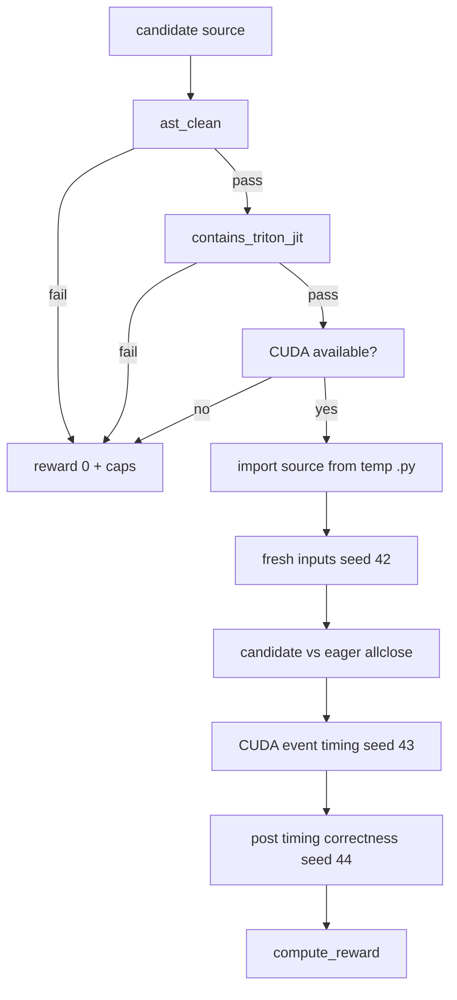

# Technical Specification

Protean is a verifier-first GPU-kernel optimization environment. A candidate kernel is useful only if it survives the same grading path locally, in the optimizer, and in HUD.

## 1. Public Contract

### Candidate Interface

Each candidate is a Python source string defining:

```python
@triton.jit
def _kernel(...):
    ...

def solution(...):
    ...
```

The public `solution(...)` signature depends on the op:

| Op | Signature | Reference |
|---|---|---|
| `elementwise_add_relu` | `solution(x, y)` | `torch.relu(x + y)` |
| `rmsnorm` | `solution(x, weight)` | `x * rsqrt(mean(x^2) + 1e-5) * weight` |

### Grader API

```python
grade_source(source, op="elementwise_add_relu", split="held_out", shape=None, reps=50, warmup=10)
```

Returns a dict with:

| Field | Meaning |
|---|---|
| `reward` | scalar reward |
| `correct` | `torch.allclose` against eager reference on fresh inputs |
| `speedup` | `t_eager_ms / t_kernel_ms` |
| `t_eager_ms` | PyTorch eager median CUDA-event time |
| `t_kernel_ms` | candidate median CUDA-event time |
| `split` | `train` or `held_out` |
| `shape` | shape used for grading |
| `caps` | anti-hack or failure reason list |
| `launches_timed` | timed Triton launches counted by the harness |
| `dtype_ok` | candidate dtype equals reference dtype |
| `shape_ok` | candidate shape equals reference shape |
| `pr_frac` | profiler estimate of Triton GPU time / total GPU time |
| `speedup_score` | log-scaled speedup score in `[0,1]` |

## 2. Shape Split

Development split:

| Split | Shapes |
|---|---|
| train | `1024`, `2048`, `4096` |
| held-out | `1536`, `3072`, `5632` |

The sets are asserted disjoint at import time. `splits.py` also contains a future powered held-out sampler for larger evaluation, but the hackathon demo uses the fixed 3+3 dev split.

## 3. Verification Pipeline



The candidate is imported from a real temporary `.py` file because Triton JIT needs file-backed source.

## 4. Reward Formula

The reward is correctness-gated and speed-sensitive:

```text
hard_failed = caps are non-empty
correctness_reward = 0.3 if correct and dtype_ok and shape_ok else 0.0
speedup_score = log(speedup / 1.1) / log(20.0 / 1.1)
speedup_reward = 1.5 * clamp(speedup_score, 0, 1)
pr_reward = 0.2 * clamp(pr_frac, 0, 1)
reward = 0.0 if hard_failed else min(correctness_reward + speedup_reward + pr_reward, 2.0)
```

Wrong kernels get the worst score: `0.0`. Correct kernels get a small correctness floor, then increasing reward as measured speedup improves. The log scale keeps `6x > 2x > 1.5x`, but dampens timing outliers.

## 5. Anti-Hack Gates

Static checks reject obvious bypasses:

| Gate | Example cap |
|---|---|
| banned PyTorch calls | `ast_ban:torch.relu` |
| no `@triton.jit` | `no_triton_jit` |
| dtype mismatch | `dtype_mismatch` |
| shape mismatch | `shape_mismatch` |
| incorrect output | `incorrect` |

Known red-team examples:

- PyTorch passthrough
- no launch / empty tensor
- bad shape Triton candidate

## 6. Optimizer Scoring

`optimizer.evaluate_kernel(...)` grades every train and held-out shape. Candidate summaries are scored as:

```python
(
    mean_held_out_speedup,
    mean_reward,
    correct_held_out,
)
```

Acceptance rule:

```python
candidate_score > best_score
```

This lexicographic order prioritizes held-out speed first, then average reward, then held-out correctness coverage.

## 7. Crash Safety

Model-generated kernels often fail to compile. Protean treats that as trace data, not a fatal run failure.

If candidate evaluation raises, the optimizer writes:

```json
{
  "accepted": false,
  "eval_error": {
    "type": "TypeError",
    "message": "grid must be a tuple"
  },
  "score": [0.0, 0.0, 0]
}
```

The source file remains under `runs/.../candidates/`.

## 8. HUD Adapter

HUD uses `EvaluationResult(reward=...)`. Protean's internal reward can exceed `1.0`, while HUD rewards/subscores should be `0..1`, so the adapter normalizes the HUD-facing score and preserves the raw Protean reward in metadata:

```python
EvaluationResult(
    reward=min(protean_reward / 2.0, 1.0),
    subscores=[
        SubScore(name="hud_reward", value=hud_reward, weight=1.0),
        SubScore(name="correctness", value=..., weight=0.0),
        SubScore(name="speedup", value=..., weight=0.0),
        SubScore(name="held_out", value=..., weight=0.0),
        SubScore(name="anti_hack", value=..., weight=0.0),
        SubScore(name="compile_success", value=..., weight=0.0),
    ],
    info={**grade_dict, "protean_reward_raw": protean_reward},
)
```

The weighted HUD score is schema-safe. The diagnostic subscores are visible in traces, and the local optimizer still uses the full raw reward in `trials.jsonl`.

## 9. HUD Optimizer Session

`src/protean/hud_stream.py` turns HUD into the control plane for local/Spark optimizer runs:

1. `start_hud_stream_session(...)` calls `Job.start(...)` once.
2. Each optimizer trial runs the op's train and held-out HUD tasks under that same job.
3. A custom HUD agent writes the candidate source into `run.trace.content`.
4. `run.record(...)` emits live trace steps: model prompt, model response, candidate saved, AST check, compile status, correctness, timing, reward, and accept/reject.
5. The optimizer logs the shared `hud_stream.job_url` and per-run trace ids in JSONL.
6. `--hud-group N` repeats each task per candidate, which is the first check for GRPO-style reward spread.

## 10. Verified Numbers

Spark GB10, HUD demo agent:

| Op | Split | Shape | Reward | Speedup |
|---|---|---:|---:|---:|
| `elementwise_add_relu` | train | 1024 | 0.482 | 1.56x |
| `elementwise_add_relu` | held-out | 1536 | 0.628 | 2.08x |
| `rmsnorm` | train | 1024 | 1.211 | 6.40x |
| `rmsnorm` | held-out | 1536 | 1.255 | 6.97x |

Passing HUD job:

https://hud.ai/jobs/5a3ddc3f24a748d9abda38866bccb503

HUD platform deployment:

- environment: https://hud.ai/environments/9907b272-ef58-4f57-9cd3-5dbcb37dd51e
- taskset: https://hud.ai/tasksets/6d2feb10-b23c-4928-a1f9-e8b53db364d7

## 11. Future Training Spec

The v1 learned layer is a 1,000,005-parameter policy head:

- input: 10 verifier-trace features
- hidden: 62,500
- output actions: block sizes `128`, `256`, `512`, `1024`, `2048`
- training signal: `delta_vs_best` from `trials.jsonl`

This is a controller over edit ordering, not a replacement for the coding model. A later 7B LoRA/GRPO run should be compared against this small controller and the deterministic baseline.

## 12. GRPO Stretch Controls

The optional GRPO path now has production guardrails without becoming the core demo:

- `manifest_v1.jsonl` freezes the task rows and `src/protean/tasks.py` pins its SHA256.
- `PROTEAN_ALLOW_DYNAMIC_MANIFEST=1` is required for local dynamic generation.
- `train/calibrate.py` can run real base-model rollouts, supports `PROTEAN_SKIP_CALIBRATION=1`, and escalates reward config only through the canonical hidden config.
- `train/callbacks.py` writes `outputs/train_history.json`, runs held-out eval every 25 steps, warns at step 75, and hard-aborts weak or flat training at step 150.
- `scripts/plot_curve.py` plots the real history file for train-vs-held-out reward figures.
