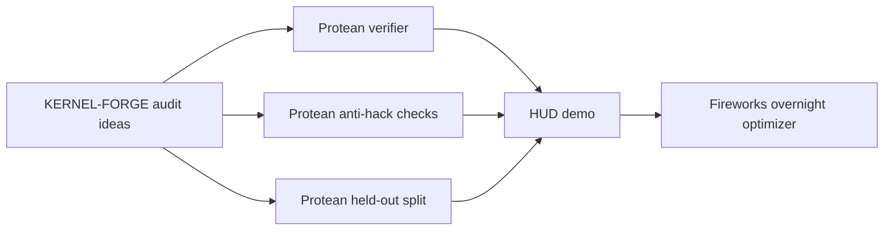

# KERNEL-FORGE Audit Lineage

KERNEL-FORGE was the larger research plan. Protean is the public, hackathon-ready implementation.

## Decision

Protean wins the public repo role because it has a narrower promise and a working artifact:

> Build the smallest verifier-first loop that can grade GPU kernels, show a credible PyTorch-vs-Triton delta, and log every optimizer decision.

KERNEL-FORGE remains useful as adversarial background. It should not define the README promise.

## What Protean Kept

- Held-out shape grading as the generalization target.
- Verifier-first design.
- Anti-hack framing: no PyTorch passthrough, real Triton launch, dtype/shape integrity.
- HUD as the public dashboard wrapper.
- Fireworks as the model-backed edit generator.
- Full trace logging for generated candidates.

## What Protean Cut

- GRPO as a required success condition.
- Large "first ever" claims.
- Multi-op graph generation.
- Multi-agent research machinery.
- Unverified state-of-the-art claims.

## Best-Of-Both-Worlds Shape

## Current Public Claim

Protean makes held-out shape performance the primary grading target for GPU-kernel optimization agents.

The current repo proves:

1. HUD can grade Protean tasks.
2. Known-good Triton kernels earn non-zero reward.
3. The optimizer saves and logs candidates.
4. Candidate crashes are rejected and preserved.

The repo does not yet prove:

1. Fireworks beats the hand kernel overnight.
2. The 1M learned policy head improves edit ordering.
3. GRPO-trained model kernels beat all baselines.

Those are next experiments, not current demo claims.
