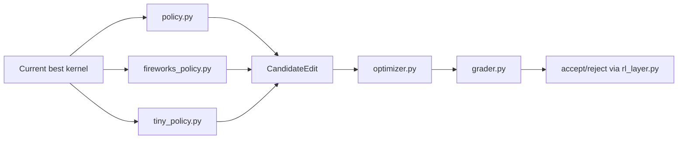

# Protean Model Layer

This folder is the single home for model-related kernel-optimizer code.

The model layer does not replace the verifier. It proposes edits, chooses edit order, and eventually tunes harness/reward policy. The verifier remains the judge.

## Figure: Model Layer Boundary



## Files

| File | Purpose |
|---|---|
| `policy.py` | Deterministic edit actions and `CandidateEdit` record. |
| `fireworks_policy.py` | Fireworks `gpt-oss-120b` backend returning JSON kernel edits. |
| `tiny_policy.py` | 1M-parameter learned policy head trained from verifier traces. |
| `rl_layer.py` | Score tuple and strict improvement acceptance rule. |
| `harness.py` | Benchmark reps/warmup knobs for candidate evaluation. |
| `prompts/kernel_optimizer.md` | Prompt contract for model-generated edits. |
| `configs/local_deterministic.json` | Current deterministic policy config. |
| `configs/tiny_policy_head.json` | 1M learned controller config. |

## Candidate Edit Contract

Every edit policy must emit:

```python
CandidateEdit(
    name="short_name",
    reason="why this might help",
    source="full Python source with @triton.jit and solution(...)",
    harness={"reps": 30, "warmup": 8},
    policy="policy_name",
    tokens=0,
    model_cost_usd=0.0,
)
```

The optimizer handles grading, acceptance, and logging.

## Fireworks Path

```bash
export FIREWORKS_API_KEY=...
python scripts/run_optimizer.py --edit-policy fireworks --all-ops --max-rounds 20
```

The request payload uses:

- `response_format={"type": "json_object"}`
- `reasoning_effort="low"`
- fallback from `content` to `reasoning_content`
- a User-Agent header

## 1M Learned Policy Head

The v1 learned controller is deliberately small:

| Property | Value |
|---|---:|
| Parameters | 1,000,005 |
| Input features | 10 |
| Actions | 5 block sizes |
| Hidden dimension | 62,500 |

Train and run:

```bash
python scripts/run_optimizer.py --max-rounds 1
python scripts/train_tiny_policy.py --trace runs/protean-overnight/trials.jsonl
python scripts/run_optimizer.py --edit-policy learned --policy-path runs/protean-overnight/tiny_policy.json
```

## Boundary

Allowed:

- propose kernel edits
- reorder candidate edits
- tune harness settings later
- propose reward/acceptance changes later

Not allowed:

- bypass the verifier
- accept candidates without held-out evaluation
- scatter model files outside this folder
- claim model improvement without trace-backed results
